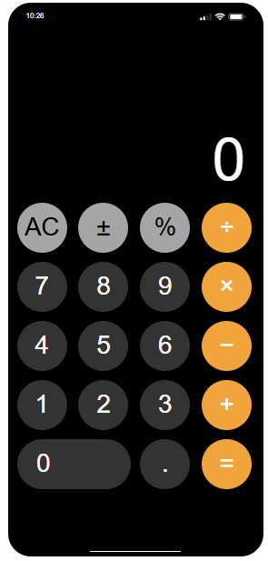

# iPhone Calculator 📱

A web-based replica of the iPhone calculator app built with HTML, CSS, and vanilla JavaScript. ✨

## Features 🚀

- **Authentic iPhone Design** 🎨: Mimics the iOS calculator interface with accurate styling and layout
- **Full Calculator Functionality** 🔢: Supports basic arithmetic operations (addition, subtraction, multiplication, division)
- **Advanced Functions** ⚡: 
  - Clear (AC) functionality
  - Plus/minus toggle (±)
  - Percentage calculations
- **Live Clock Display** 🕒: Shows current time in the top status bar
- **Responsive Interactions** 💫: Visual feedback on button press with brightness animations

## File Structure 📁

```
├── Iphone.html          # Main HTML structure
├── Iphone.js            # Calculator logic and functionality
├── style.css            # Styling and iPhone appearance
└── status.png           # Status bar icon (referenced but not included)
```

## Usage 💻

1. Open `Iphone.html` in a web browser 🌐
2. Use the calculator interface by clicking buttons or using keyboard input ⌨️
3. The display shows results with proper number formatting (comma separators) 📊

## Technical Implementation ⚙️

- **Pure JavaScript** 🟡: No external frameworks or dependencies
- **Grid Layout** 📏: CSS Grid for button arrangement
- **Event-Driven** 🎯: Click handlers for all calculator operations
- **Memory Management** 🧠: Stores previous values and operations for chained calculations

## Browser Compatibility ✅

Compatible with all modern web browsers that support:
- ES6 JavaScript features
- CSS Grid
- DOM manipulation APIs

## Setup 🛠️

No build process required. Simply open `Iphone.html` in your preferred web browser to start using the calculator. 🎉

---
## Images 📸

# IPHONE-calc
